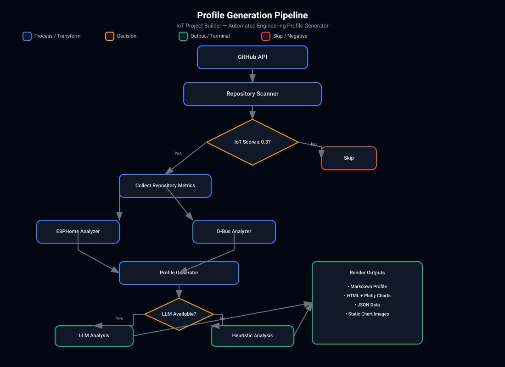
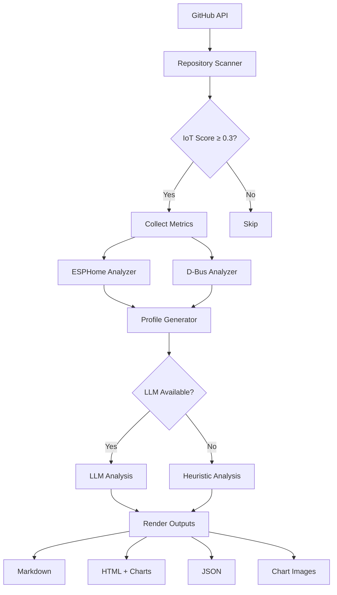
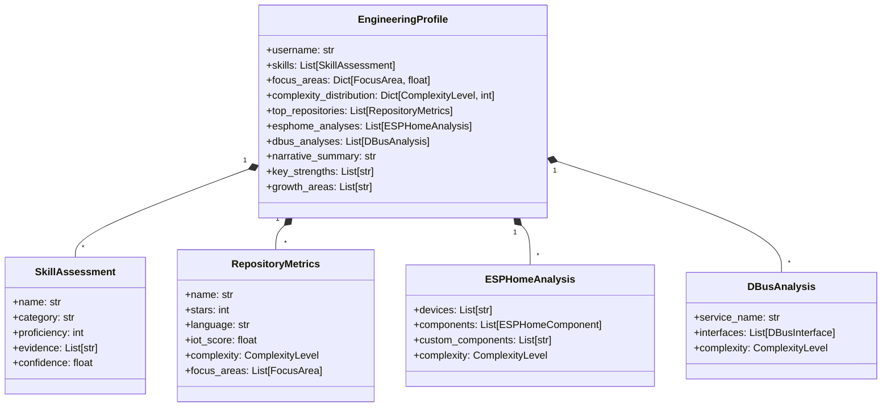

# IoT Project Builder Profile

> Automated engineering profile generator for IoT developers based on GitHub activity

Analyzes a developer's GitHub repositories, ESPHome configurations, and D-Bus services to generate a comprehensive engineering profile with skill assessments, focus areas, and interactive visualizations.



## Features

- **GitHub Scanner** - Identifies IoT-related repositories using keyword matching, language detection, and activity scoring
- **ESPHome Analyzer** - Parses YAML configurations to extract devices, components, integrations, and custom components
- **D-Bus Analyzer** - Extracts interfaces, methods, signals, and properties from Python D-Bus services
- **LLM-Generated Profile** - Uses Anthropic Claude to create evidence-based skill assessments and narrative summaries
- **Multi-Format Output** - Markdown, HTML (with embedded Plotly charts), JSON, and static chart images
- **GitHub Action** - Automated weekly profile updates

## Architecture



## Quick Start

```bash
# Install with pipx (recommended)
pipx install git+https://github.com/4alvit/iot-project-builder-profile.git

# Or install in development mode
git clone https://github.com/4alvit/iot-project-builder-profile.git
cd iot-project-builder-profile
pip install -e ".[dev]"

# Generate profile (with LLM)
iot-profile-builder 4alvit --token $GITHUB_TOKEN --output ./profile

# Generate profile (heuristic only, no API key needed)
iot-profile-builder 4alvit --no-llm --output ./profile
```

## Configuration

### Environment Variables

| Variable | Description | Required |
|----------|-------------|----------|
| `GITHUB_TOKEN` | GitHub Personal Access Token (public_repo scope) | Yes |
| `ANTHROPIC_API_KEY` | Anthropic API key for LLM analysis | No (falls back to heuristic) |

### CLI Options

```bash
iot-profile-builder USERNAME [OPTIONS]

Options:
  -t, --token TEXT       GitHub personal access token
  -o, --output PATH      Output directory (default: .)
  -m, --max-repos INT    Max repositories to scan (default: 100)
  --no-llm               Disable LLM analysis (heuristic only)
  -h, --help             Show help message
```

## Output Formats

| Format | Description | File |
|--------|-------------|------|
| Markdown | Human-readable profile with tables | `username_profile.md` |
| HTML | Interactive dashboard with Plotly charts | `username_profile.html` |
| JSON | Machine-readable structured data | `username_profile.json` |
| Charts | Static PNG charts (radar, pie, bar) | `charts/*.png` |

## Sample Output

### Focus Areas Radar Chart


### Complexity Distribution


### Skills Assessment


## GitHub Action

The included workflow (`.github/workflows/update-profile.yml`) runs weekly to keep your profile current.

### Setup

1. Add `ANTHROPIC_API_KEY` to repository secrets (optional)
2. Enable GitHub Actions on your fork
3. Trigger manually via "Actions" tab or wait for Monday 6 AM UTC run

### Customization

```yaml
# In workflow_dispatch inputs
username: "your-github-username"  # Target user to analyze
use-llm: true                     # Enable/disable LLM analysis
```

## Project Structure

```
iot-project-builder-profile/
├── .github/workflows/     # GitHub Actions
├── src/
│   ├── cli.py             # Main CLI entry point
│   ├── models.py          # Core data models (Pydantic-free)
│   ├── scanner/
│   │   └── github_scanner.py  # GitHub API scanner
│   ├── analyzers/
│   │   ├── esphome_analyzer.py  # ESPHome YAML parser
│   │   └── dbus_analyzer.py     # D-Bus service analyzer
│   ├── generator/
│   │   └── profile_generator.py # LLM + heuristic profile gen
│   └── output/
│       └── renderer.py    # Markdown/HTML/JSON/Charts
├── tests/                 # Pytest test suite
├── pyproject.toml         # Project config
└── README.md              # This file
```

## Data Models



## Development

```bash
# Run tests
pytest -v --cov=src

# Type checking
mypy src/

# Linting
ruff check src/

# Format
ruff format src/
```

## Tech Stack

- **Python 3.11+**
- **GitHub API** via PyGithub
- **YAML Parsing** via PyYAML
- **Templating** via Jinja2
- **Charts** via Plotly
- **LLM** via Anthropic SDK (optional)
- **CLI** via Rich

## License

MIT License - see [LICENSE](LICENSE) for details.

## Related Projects

- [esphome](https://github.com/esphome/esphome) - ESPHome firmware framework
- [dbus-python](https://github.com/freedesktop/dbus-python) - Python D-Bus bindings
- [Victron Energy](https://www.victronenergy.com/) - Energy management systems