# IoT Project Builder Portfolio

> Complete Venus OS / IoT ecosystem across 26 repositories — hardware, control, visualization, AI, and infrastructure


## 🏗️ Architecture Overview

```mermaid
graph TB
    subgraph Hardware["Hardware Layer"]
        ESP32[ESP32 + CT Sensors]
        BLE[BLE Sensors<br/>JBD/Daly BMS, Temp, Plant]
        Tasmota[Tasmota PV Meters]
    end

    subgraph Data["Data Layer"]
        MQTT[(MQTT Broker)]
        DBUS[D-Bus<br/>Victron Venus OS]
        ESPHOME[ESPHome<br/>Firmware]
    end

    subgraph Control["Control Layer"]
        INV_CTRL[inverter-control<br/>Grid-zero feed-in]
        GOV[venus-os-governance<br/>Policy engine + safety]
        EVENT[dbus-event-log<br/>Audit logging]
    end

    subgraph Viz["Visualization Layer"]
        DASH_GO[inverter-dashboard-go<br/>Production web dashboard]
        DESK[inverter-desktop<br/>Native Electron/Tauri app]
        VUE_LIB[inverter-dashboard-vue<br/>Shared Vue 3 components]
        MON[inverter-monitoring<br/>Telegraf/InfluxDB/Grafana]
    end

    subgraph AI["AI & Intelligence"]
        RAG[energy-data-rag-pipeline<br/>RAG on Victron docs]
        MCP[mcp-venus-os<br/>MCP server for LLM control]
        SOLAR[solar-forecast-langgraph<br/>LangGraph forecasting]
    end

    subgraph Infra["Infrastructure & DevOps"]
        TF_VICTRON[terraform-github-victron<br/>Org IaC]
        TF_PERSONAL[terraform-github-4alvit<br/>Personal IaC]
        INTEG[integration-tests<br/>Cross-project tests]
        OTEL_PERS[mqtt-observability-opentelemetry<br/>Generic MQTT OTel]
        OTEL_ORG[venus-os-observability<br/>Venus OS OTel]
        SVC_TMPL[dbus-service-template<br/>D-Bus service copier template]
        FASTAPI[fastapi-mqtt-gateway<br/>REST/WS ↔ MQTT bridge]
        ESP_BLE[esphome-ble-sensor-patterns<br/>BLE sensor patterns]
        BLD_PROF[iot-project-builder-profile<br/>This portfolio]
        PG_PROF[4alvit<br/>Personal utilities]
    end

    %% Hardware connections
    ESP32 -->|MQTT| MQTT
    BLE -->|ESPHome| ESPHOME
    Tasmota -->|MQTT| MQTT

    %% Data layer
    ESPHOME -->|MQTT| MQTT
    MQTT -->|Bridge| DBUS
    DBUS -->|Subscribe| INV_CTRL
    DBUS -->|Subscribe| GOV
    DBUS -->|Subscribe| EVENT

    %% Control
    INV_CTRL -->|Commands| DBUS
    GOV -->|Approve/Reject| INV_CTRL
    EVENT -->|Logs| DBUS

    %% Visualization
    MQTT -->|Real-time| DASH_GO
    MQTT -->|Real-time| DESK
    VUE_LIB -.->|Components| DASH_GO
    VUE_LIB -.->|Components| DESK
    DBUS -->|Metrics| MON

    %% AI
    DBUS -->|Data| RAG
    DBUS -->|Control| MCP
    MQTT -->|History| SOLAR

    %% Infra
    TF_VICTRON -.->|Manages| INV_CTRL
    TF_VICTRON -.->|Manages| DASH_GO
    OTEL_PERS -.->|Monitors| MQTT
    OTEL_ORG -.->|Monitors| DBUS
    INTEG -.->|Tests| INV_CTRL
    INTEG -.->|Tests| DASH_GO
```



## 🌟 Featured Projects

| Project | Type | Commits | Description |
|---------|------|---------|-------------|
| **[inverter-control](https://github.com/victron-venus/inverter-control)** | Python | 336 | Grid-zero feed-in control with Home Assistant integration. The core control engine. |
| **[inverter-desktop](https://github.com/victron-venus/inverter-desktop)** | Vue/Electron | 545 | Native desktop monitoring app. Most mature UI. |
| **[inverter-dashboard-go](https://github.com/victron-venus/inverter-dashboard-go)** | Go | 185 | Production web dashboard with Docker Hub deployment. Real-time MQTT/WebSocket. |
| **[dbus-mqtt-battery](https://github.com/victron-venus/dbus-mqtt-battery)** | Python | ~200 | JBD BMS → D-Bus bridge with DVCC support. Battle-tested on 8+ BMS units. |
| **[mqtt-observability-opentelemetry](https://github.com/4alvit/mqtt-observability-opentelemetry)** | Python | ~150 | Complete OpenTelemetry stack for MQTT IoT. Generic, broker-agnostic. |

## 🛠️ Technology Matrix

| Category | Technologies |
|----------|--------------|
| **Languages** | Python 3.11+, Go 1.22+, Vue 3 / TypeScript, HCL (Terraform), YAML |
| **Protocols** | MQTT 3.1/5, D-Bus, Modbus, BLE, HTTP/REST, WebSocket |
| **Frameworks** | FastAPI, ESPHome, Electron/Tauri, LangGraph, Rich CLI |
| **Observability** | OpenTelemetry, Prometheus, Grafana, Jaeger, InfluxDB |
| **Infrastructure** | Docker, Docker Compose, Terraform, GitHub Actions, Copier |
| **Hardware** | ESP32 (S3/BOX-3), CT Sensors (SCT-013), BLE Sensors, Cerbo GX |
| **AI/ML** | Anthropic SDK, LangChain, pgvector, LangGraph |

## 🚀 Getting Started

### Minimal Victron Setup (Grid-Zero Control)

```bash
# 1. Hardware: ESP32 + SCT-013 CT sensor on grid feed
# 2. Firmware: Flash ESPHome grid-sensor.yaml (from dbus-esphome-grid-sensor)
# 3. Bridge: Run dbus-mqtt-battery for BMS or dbus-tasmota-pv for PV
# 4. Control: Deploy inverter-control via Docker
# 5. Dashboard: Access inverter-dashboard-go at :8080 or install inverter-desktop
```

### Full Observability Stack

```bash
# 1. Deploy mqtt-observability-opentelemetry (generic MQTT OTel)
docker compose -f mqtt-observability-opentelemetry/docker-compose.yml up -d

# 2. Add venus-os-observability for Venus OS specific metrics
docker compose -f venus-os-observability/docker-compose.yml up -d

# 3. Configure Grafana dashboards (pre-built included)
```

### AI-Assisted Operations

```bash
# 1. Start MCP server for LLM control
cd mcp-venus-os && pip install -e . && mcp-venus-os

# 2. Query solar forecast
cd solar-forecast-langgraph && python -m src.main

# 3. RAG queries on Victron docs
cd energy-data-rag-pipeline && python -m src.query "How to configure grid-zero?"
```

## 📦 Repository Catalog

### victron-venus Organization (15 repos)

#### Control & Automation
| Repo | Language | Description |
|------|----------|-------------|
| [inverter-control](https://github.com/victron-venus/inverter-control) | Python | Grid-zero feed-in control, HA integration, safety limits |
| [venus-os-governance](https://github.com/victron-venus/venus-os-governance) | Python | Policy engine: SOC floors, rate limits, time restrictions, approval gates |
| [dbus-event-log](https://github.com/victron-venus/dbus-event-log) | Python | Audit log of D-Bus commands & state transitions (SQLite/TimescaleDB) |

#### Hardware Bridges
| Repo | Language | Description |
|------|----------|-------------|
| [dbus-mqtt-battery](https://github.com/victron-venus/dbus-mqtt-battery) | Python | JBD BMS MQTT→D-Bus bridge with DVCC support |
| [dbus-tasmota-pv](https://github.com/victron-venus/dbus-tasmota-pv) | Python | Tasmota PV inverter → Victron D-Bus bridge |
| [esphome-jbd-bms-mqtt](https://github.com/victron-venus/esphome-jbd-bms-mqtt) | YAML | ESP32 Bluetooth proxy for JBD BMS → MQTT |

#### Visualization
| Repo | Language | Description |
|------|----------|-------------|
| [inverter-dashboard-go](https://github.com/victron-venus/inverter-dashboard-go) | Go | **Production** web dashboard: real-time MQTT/WS, Docker Hub, HA |
| [inverter-desktop](https://github.com/victron-venus/inverter-desktop) | Vue/Electron | **Native** desktop app (Electron/Tauri), uses shared Vue components |
| [inverter-dashboard-vue](https://github.com/victron-venus/inverter-dashboard-vue) | Vue | Shared Vue 3 component library: ECharts widgets, MQTT hooks, Tailwind |
| [inverter-dashboard](https://github.com/victron-venus/inverter-dashboard) | Python | Legacy prototype (FastAPI + Vue) — use dashboard-go or desktop |
| [inverter-monitoring](https://github.com/victron-venus/inverter-monitoring) | Python | Telegraf + InfluxDB + Grafana stack for long-term metrics |

#### Observability & Infrastructure
| Repo | Language | Description |
|------|----------|-------------|
| [venus-os-observability](https://github.com/victron-venus/venus-os-observability) | Python | Venus OS specific OTel: D-Bus tracing, inverter metrics, Cerbo integration |
| [integration-tests](https://github.com/victron-venus/integration-tests) | Python | Cross-project integration tests |
| [terraform-github-victron](https://github.com/victron-venus/terraform-github-victron) | HCL | Org GitHub repo management via Terraform |
| [.github](https://github.com/victron-venus/.github) | — | Organization profile & templates |
| [SetupHelper](https://github.com/victron-venus/SetupHelper) | Python | Fork of Venus OS setup utility |

#### Reference
| Repo | Language | Description |
|------|----------|-------------|
| [esphome-ble-sensor-patterns](https://github.com/victron-venus/esphome-ble-sensor-patterns) | YAML | Production ESPHome BLE patterns: JBD/Daly BMS, Xiaomi/Inkbird temp, Mi Flora |
| [dbus-service-template](https://github.com/victron-venus/dbus-service-template) | Python | Copier template for D-Bus services |

---

### 4alvit Personal (11 repos)

#### AI & Intelligence
| Repo | Language | Description |
|------|----------|-------------|
| [energy-data-rag-pipeline](https://github.com/4alvit/energy-data-rag-pipeline) | Python | RAG pipeline on Victron docs + energy data |
| [mcp-venus-os](https://github.com/4alvit/mcp-venus-os) | Python | MCP server exposing Venus OS control to LLMs |
| [solar-forecast-langgraph](https://github.com/4alvit/solar-forecast-langgraph) | Python | LangGraph-based solar production forecasting |

#### Observability & Platform
| Repo | Language | Description |
|------|----------|-------------|
| [mqtt-observability-opentelemetry](https://github.com/4alvit/mqtt-observability-opentelemetry) | Python | **Best personal project** — Generic MQTT OTel stack, broker-agnostic |
| [fastapi-mqtt-gateway](https://github.com/4alvit/fastapi-mqtt-gateway) | Python | REST/WebSocket ↔ MQTT bridge with topic routing |

#### Templates & Utilities
| Repo | Language | Description |
|------|----------|-------------|
| [dbus-service-template](https://github.com/4alvit/dbus-service-template) | Python | Copier template for production D-Bus services |
| [esphome-ble-sensor-patterns](https://github.com/4alvit/esphome-ble-sensor-patterns) | YAML | ESPHome BLE sensor patterns (duplicate of org for personal indexing) |
| [iot-project-builder-profile](https://github.com/4alvit/iot-project-builder-profile) | Python | **This repo** — Engineering profile generator from GitHub activity |
| [4alvit](https://github.com/4alvit/4alvit) | Python | Personal CLI utilities |
| [terraform-github-4alvit](https://github.com/4alvit/terraform-github-4alvit) | HCL | Personal GitHub Terraform IaC |
| [terraform-github-victron](https://github.com/4alvit/terraform-github-victron) | HCL | Mirror of org Terraform for reference |

---

## 🔗 Cross-References

| If you need... | Start with... | Then add... |
|----------------|---------------|-------------|
| Grid-zero control | `inverter-control` | `venus-os-governance`, `dbus-event-log` |
| Web dashboard | `inverter-dashboard-go` | `inverter-dashboard-vue` |
| Native desktop app | `inverter-desktop` | `inverter-dashboard-vue` |
| BMS integration | `dbus-mqtt-battery` | `esphome-jbd-bms-mqtt` |
| PV meter integration | `dbus-tasmota-pv` | — |
| MQTT observability (generic) | `mqtt-observability-opentelemetry` | — |
| Venus OS observability | `venus-os-observability` | `mqtt-observability-opentelemetry` |
| LLM control of inverter | `mcp-venus-os` | `inverter-control` |
| Solar forecasting | `solar-forecast-langgraph` | `inverter-control` |
| RAG on Victron docs | `energy-data-rag-pipeline` | — |

## 📊 Project Status

| Repo | Status | CI | Docker | Tests | Docs |
|------|--------|----|--------|-------|------|
| inverter-control | ✅ Production | ✅ | ✅ | ✅ | ✅ |
| inverter-dashboard-go | ✅ Production | ✅ | ✅ (Docker Hub) | ✅ | ✅ |
| inverter-desktop | ✅ Production | ✅ | ✅ | ✅ | ✅ |
| inverter-dashboard-vue | ✅ Library | ✅ | N/A | ✅ | ✅ |
| dbus-mqtt-battery | ✅ Production | ✅ | ✅ | ✅ | ✅ |
| venus-os-governance | 🚧 Scaffold | ❌ | ❌ | ❌ | ✅ |
| mqtt-observability-opentelemetry | ✅ Active | ✅ | ✅ | 🚧 | ✅ |
| esphome-ble-sensor-patterns | ✅ Reference | ✅ | N/A | N/A | ✅ |
| energy-data-rag-pipeline | 🚧 Prototype | ❌ | ❌ | ❌ | ✅ |
| solar-forecast-langgraph | 🚧 Prototype | ❌ | ❌ | ❌ | ✅ |

---

## 🤝 Contributing

This is a personal portfolio organization. Issues and PRs welcome on individual repos.

## 📄 License

All repos use MIT License unless noted otherwise.

---

**Maintained by [4alvit](https://github.com/4alvit)** · Part of the Victron/Energy monitoring ecosystem